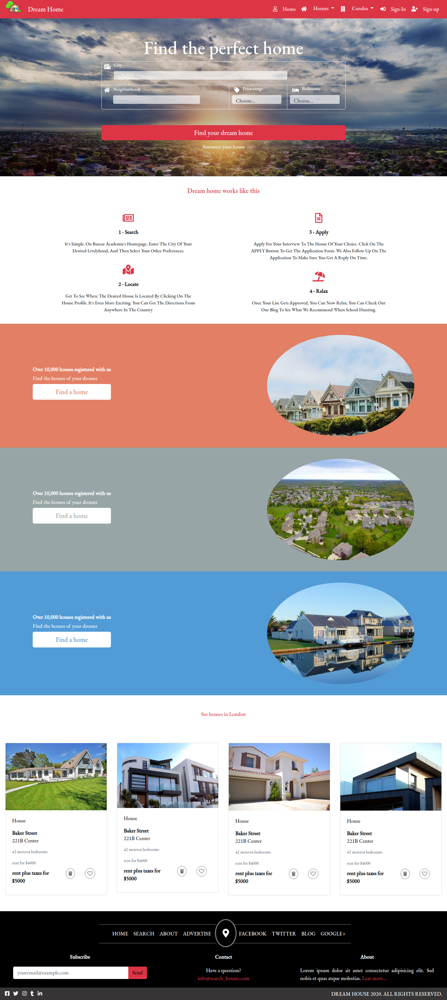

# Microverse HTML and CSS Capstone Project

> Capstone projects are solo projects at the end of the each of the Microverse Main Technical Curriculum sections. It is a real-world-like project built with business specifications. In this case, the goal was to build a personalized paged based on [this](https://www.behance.net/gallery/25563385/PatashuleKE) layout.

## First Page

## Built With

- HTML 5 and CSS 3.
- Font awesome.
- Bootstrap 4.
- Flexbox.
- Css grid system.

## Live Demo

[Live Demo Link](https://rawcdn.githack.com/expjazz/capstone-project/56bb72cc67c5637c2444793043cb6cc978c8d50e/index.html)

## Video Description

- Here is a brief video explaining the features of the project.

[Video](https://www.loom.com/share/b7e76743e7e74e339bd414b1b2f12414)

### Prerequisites

Having a web browser, code editor and git.

### Install

Just fork it and open in your browser and are good to go.

## Author

👤 **Expedito Andrade**

- Github: [@githubexpjazz](https://github.com/expjazz)
- Twitter: [@expjazz](https://twitter.com/expeditoandrade13)
- Linkedin: [Expedito Andrade](https://www.linkedin.com/in/expedito-andrade-3645151a4/)
- Email: (expeditojazz@gmail.com)

## 🤝 Contributing

Contributions, issues and feature requests are welcome!

Feel free to check the [issues page](issues/).

## Show your support

Give a ⭐️ if you like this project!

## Credits

- Design Created by Mather Njuguna and Sam Achola on behance.
- See the Design Template on behance

## 📝 License

This project is [MIT](./LICENSE) licensed.
